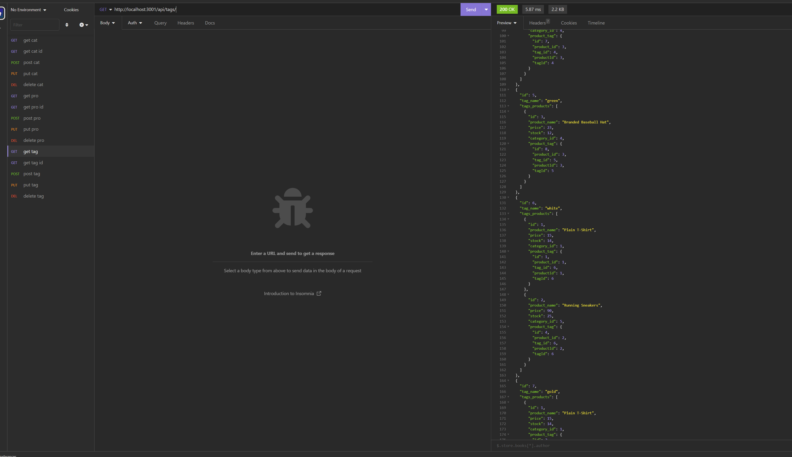

# e-commerce-back-end

## Descripion

This project can be used to view/add/update/delete products, tags, and categories in a db

## technologys

The project uses mySQL, Node, and JavaScript

## learned

I learned how to use Sequelize the interact with a db

## Task

GIVEN a functional Express.js API
WHEN I add my database name, MySQL username, and MySQL password to an environment variable file
THEN I am able to connect to a database using Sequelize
WHEN I enter schema and seed commands
THEN a development database is created and is seeded with test data
WHEN I enter the command to invoke the application
THEN my server is started and the Sequelize models are synced to the MySQL database
WHEN I open API GET routes in Insomnia for categories, products, or tags
THEN the data for each of these routes is displayed in a formatted JSON
WHEN I test API POST, PUT, and DELETE routes in Insomnia
THEN I am able to successfully create, update, and delete data in my database 

## Usage

If the user opens the terminal for the folder of the project and the user can seed the db and then is able to do get, post, put, and delete requests to the server

## Repo
https://github.com/hayessea000/e-commerce-back-end

## Video of use
https://drive.google.com/file/d/11UgqteDx1dS3Zb6K_HVHr107efv9VLu-/view

